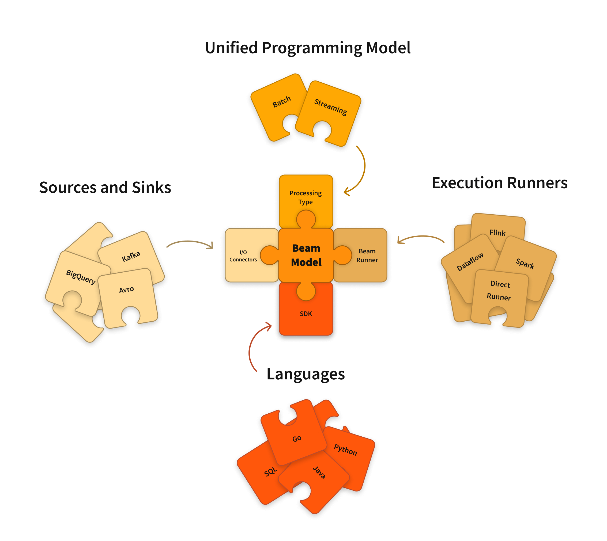

# Apache Beam Playground

Repo for playing around with Apache Beam.

## Setup

Ensure Python 3.11 is installed with pyenv and poetry is installed with pipx. Then run:

```bash
pyenv local 3.11
make setup
```

This will install the project dependencies and pre-commit hooks.

## What is Apache Beam?

Apache Beam is an open source, unified model for defining both batch and streaming data-parallel processing pipelines. Using one of the open source Beam SDKs, you build a program that defines the pipeline. The pipeline is then executed by one of Beam’s supported distributed processing back-ends, which include Apache Flink, Apache Spark, and Google Cloud Dataflow.

Beam is particularly useful for embarrassingly parallel data processing tasks, in which the problem can be decomposed into many smaller bundles of data that can be processed independently and in parallel. You can also use Beam for Extract, Transform, and Load (ETL) tasks and pure data integration. These tasks are useful for moving data between different storage media and data sources, transforming data into a more desirable format, or loading data onto a new system.



The Beam Pipeline Runners translate the data processing pipeline you define with your Beam program into the API compatible with the distributed processing back-end of your choice. When you run your Beam program, you’ll need to specify an appropriate runner for the back-end where you want to execute your pipeline.

Beam currently supports the following runners:

- Direct
- Apache Flink
- Apache Nemo
- Apache Samza
- Apache Spark
- Google Cloud Dataflow
- Hazelcast Jet
- Twister2

## Wordcount Example

The following example is taken from the [Beam Quickstart](https://beam.apache.org/get-started/quickstart-py/).

You will need to download the input data from the [Beam Quickstart](https://beam.apache.org/get-started/quickstart-py/) page and place it in the `tmp` directory.

```bash
poetry run python src/wordcount_minimal.py --input=tmp/kinglear.txt --output=tmp/outputfile.txt  --runner=DirectRunner
```

For the streaming wordcount example, you will need to create a PubSub topic and subscription and set the `GOOGLE_APPLICATION_CREDENTIALS` environment variable to the path of the service account key file.

```bash
poetry run python src/streaming_wordcount.py \
  --input_topic "projects/YOUR_PUBSUB_PROJECT_NAME/topics/YOUR_INPUT_TOPIC" \
  --output_topic "projects/YOUR_PUBSUB_PROJECT_NAME/topics/YOUR_OUTPUT_TOPIC" \
  --streaming
  --streaming
```
